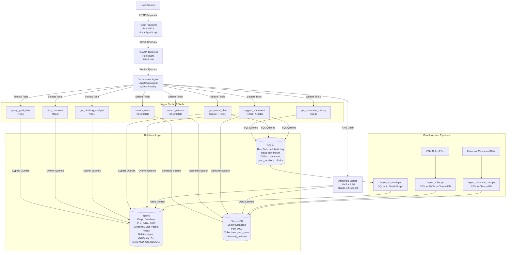
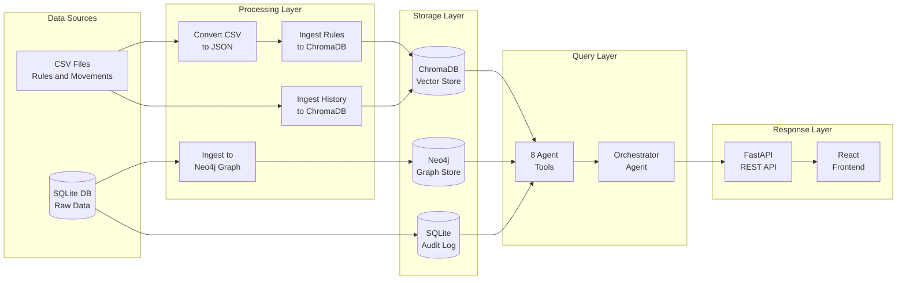
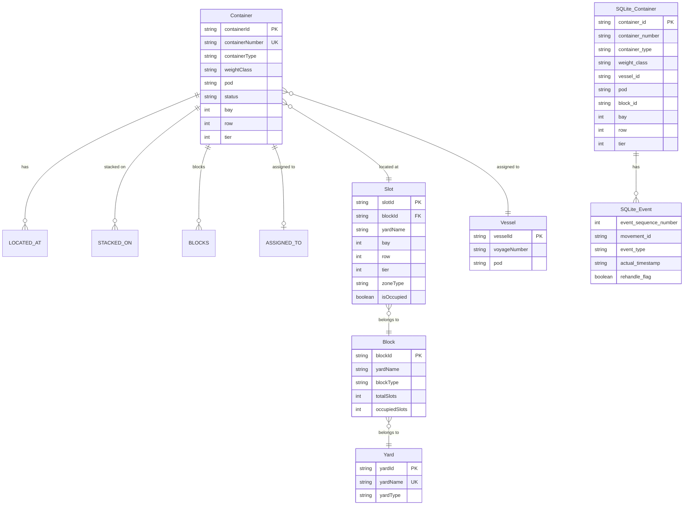
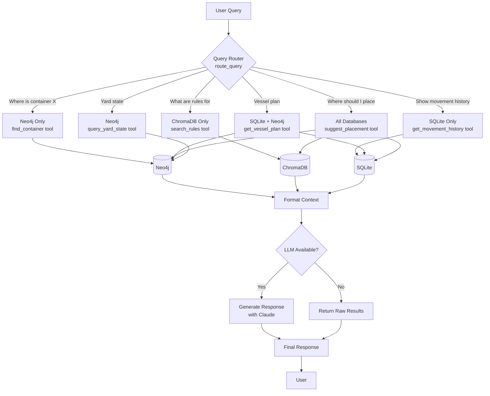
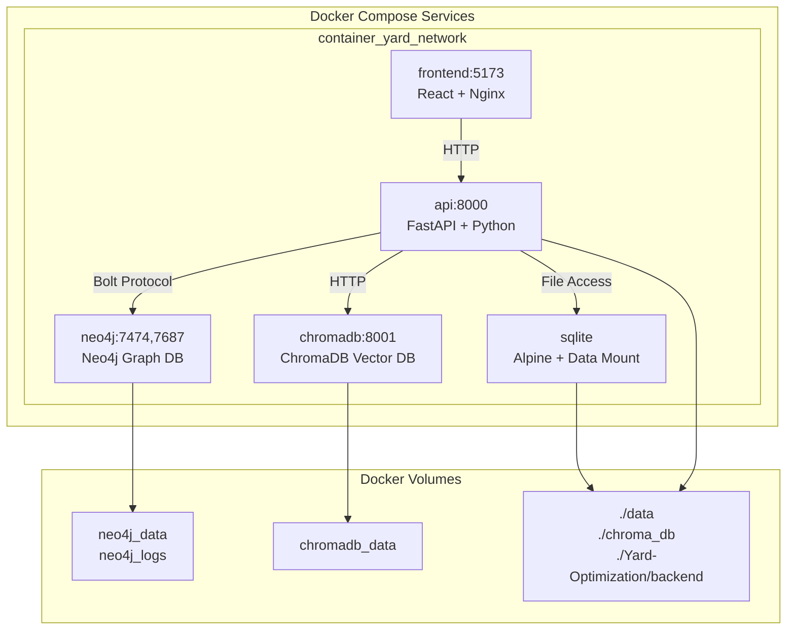
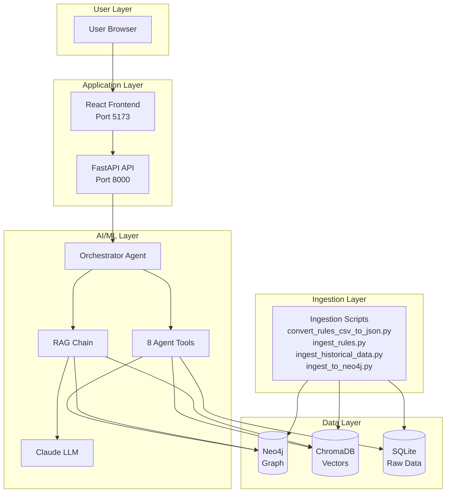

# Container Yard Optimization - Architecture Diagram

## Complete System Architecture

---

## Data Flow Architecture

---

## Database Schema Architecture

---

## Query Routing Flow

---

## Docker Container Architecture

---

## Complete System Overview

---

## Request Flow Architecture

```mermaid
sequenceDiagram
    participant User
    participant Frontend
    participant API
    participant Orchestrator
    participant Tools
    participant Neo4j
    participant ChromaDB
    participant SQLite
    participant LLM
    
    User->>Frontend: HTTP Request
    Frontend->>API: REST API Call
    API->>Orchestrator: Route Query
    Orchestrator->>Orchestrator: Analyze Query Type
    Orchestrator->>Tools: Select Appropriate Tool
    
    alt Neo4j Query
        Tools->>Neo4j: Cypher Query
        Neo4j-->>Tools: Graph Results
    else ChromaDB Query
        Tools->>ChromaDB: Semantic Search
        ChromaDB-->>Tools: Vector Results
    else SQLite Query
        Tools->>SQLite: SQL Query
        SQLite-->>Tools: Raw Data
    else Hybrid Query
        Tools->>Neo4j: Cypher Query
        Tools->>ChromaDB: Semantic Search
        Tools->>SQLite: SQL Query
        Neo4j-->>Tools: Graph Results
        ChromaDB-->>Tools: Vector Results
        SQLite-->>Tools: Raw Data
    end
    
    Tools-->>Orchestrator: Combined Results
    Orchestrator->>LLM: RAG Chain with Context
    LLM-->>Orchestrator: Generated Response
    Orchestrator-->>API: Formatted Response
    API-->>Frontend: JSON Response
    Frontend-->>User: Display Results
```

---

## Component Details

### Services Running:
1. **Frontend** (React + Vite) - Port 5173
2. **API** (FastAPI) - Port 8000
3. **Neo4j** (Graph DB) - Ports 7474, 7687
4. **ChromaDB** (Vector DB) - Port 8001
5. **SQLite** (Data Mount) - Read-only

### Agent Tools (8):
1. `query_yard_state` → Neo4j
2. `find_container` → Neo4j
3. `get_blocking_analysis` → Neo4j
4. `search_rules` → ChromaDB
5. `search_patterns` → ChromaDB
6. `get_movement_history` → SQLite
7. `get_vessel_plan` → SQLite + Neo4j
8. `suggest_placement` → All 3 DBs

### Data Flow:
- **CSV Rules** → JSON → ChromaDB
- **Historical Data** → ChromaDB
- **SQLite Data** → Neo4j Graph
- **User Query** → Orchestrator → Tools → Databases → Response
